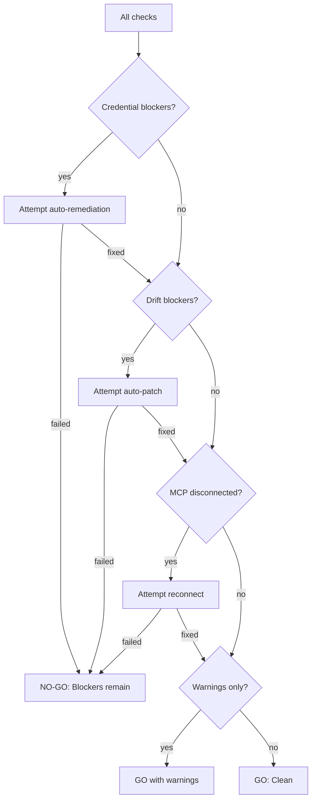

# Readiness Gate

The single gate every significant task passes through before execution begins. If it's
broken, we fix it before we start — not at step 7 of 12.

## Activation

- **Auto-trigger**: Before any mission, complex multi-step task, or long-running session
- **Manual trigger**: "readiness check", "pre-flight", "gate check"

## Step 1 — Gather Task Requirements

Parse the task description to determine:
- Required MCP servers and tools
- Required credentials/services
- Required skills
- Target environments (web surfaces, APIs, filesystems)
- Expected duration (short < 1h, medium 1-4h, long > 4h)

## Step 2 — Run Readiness Checks (Parallel Where Possible)

### Check 1: Credential Health
Invoke `credential-escrow` skill for pre-task check.
- Are all required credentials healthy?
- Any expiring within task duration + buffer?
- Result: `{pass, warnings, blockers}`

### Check 2: Environment Drift
Invoke `environment-drift-monitor` for pre-task check.
- Are all target surfaces healthy?
- Any skills quarantined due to drift?
- Any probes failing?
- Result: `{drift_ok: bool, affected_skills, remediations}`

### Check 3: MCP Connectivity
For each required MCP server:
1. Check connection status (`smithery mcp list` or direct tool call)
2. Verify expected tools are available
3. Test a lightweight read-only tool call if possible
- Result: `{connected: [...], disconnected: [...], degraded: [...]}`

### Check 4: Skill Freshness
For each required skill:
1. Check when it was last updated
2. Check if any drift was detected for its surfaces
3. Check if error patterns reference it
- Result: `{fresh: [...], stale: [...], quarantined: [...]}`

### Check 5: Dependency Health
- Are required CLI tools available on PATH? (smithery, doppler, python, node, etc.)
- Are required Python packages importable?
- Are required config files present and valid JSON?
- Result: `{available: [...], missing: [...]}`

### Check 6: Session Capacity
- Are there enough available sessions/context for the task?
- Any conflicting sessions running?
- Result: `{ok: bool, note: "..."}`

## Step 3 — Compute Gate Decision



Decision outcomes:
- **GO (clean)**: All checks pass, no warnings
- **GO (warnings)**: All blockers resolved, some warnings remain (e.g., credential expiring in 2 days but task is 1h)
- **NO-GO (blockers)**: One or more blockers could not be auto-remediated. Escalate to user with exact remediation steps.

## Step 4 — Auto-Remediate Where Possible

For each failing check, attempt remediation before escalating:

| Check Failure          | Auto-Remediation                                       |
|------------------------|--------------------------------------------------------|
| Expired credential     | `credential-escrow` auto-renewal                       |
| Drift detected         | `environment-drift-monitor` auto-patch (low-risk only) |
| MCP disconnected       | `mcp-connection-triage` reconnect                      |
| Missing CLI tool       | Install if safe (npm/pip), escalate if complex          |
| Quarantined skill      | Report reason, cannot auto-fix                          |
| Missing config file    | Recreate from template if available                     |

## Step 5 — Produce Gate Report

```
═══════════════════════════════════════════
  READINESS GATE
  Task: {name}
  Time: {ISO-8601}
  Decision: GO (warnings) | GO (clean) | NO-GO
═══════════════════════════════════════════

CREDENTIALS
  ✅ github-token: healthy (expires 2026-06-15)
  ⚠️  ntreis-session: expiring in 3h (attempted renewal, pending re-auth)

DRIFT
  ✅ ntreis-login-page: no drift detected
  ✅ taxnet-search: no drift detected

MCP CONNECTIVITY
  ✅ comet-browser-control-handoff: connected, 6 tools
  ✅ smithery-smart: connected

SKILL FRESHNESS
  ✅ neon-ops: last updated 2026-06-06

DEPENDENCIES
  ✅ smithery CLI v2.1.0
  ✅ doppler CLI v3.68.0
  ✅ python 3.12

SESSION CAPACITY
  ✅ 12 sessions available

───────────────────────────────────────────
VERDICT: GO (warnings — 1)
  ntreis auth needs manual re-auth before proceeding
───────────────────────────────────────────
```

## Step 6 — On NO-GO

If auto-remediation fails and blockers remain:

1. Present the gate report with clear NO-GO verdict
2. For each blocker, provide:
   - What's wrong
   - What was attempted (auto-remediation steps)
   - What you need to do
   - Exact command or URL if applicable
3. Ask: "Fix these blockers and retry, or proceed anyway?"
4. If user says "proceed anyway", log the override and continue with warnings

## Output Contract

- Gate report (human-readable, as shown above)
- Gate decision: GO (clean), GO (warnings), NO-GO (blockers)
- For NO-GO: remediation instructions per blocker
- All check results logged to knowledge stores for trend analysis

## Guardrails

- Gate must complete within 60 seconds for lightweight checks; 3 minutes for full check
- Never block a task for warnings — only for failed auto-remediations
- If a check can't run (tool unavailable), mark as `unknown` not `fail`
- User can always override NO-GO with "proceed anyway"

## Integration Points

- **credential-escrow**: Called for credential health check
- **environment-drift-monitor**: Called for drift check
- **mcp-connection-triage**: Called for MCP reconnection
- **self-calibrating-autonomy**: Uses autonomy policy for go/no-go decisions
- **mission-orchestrator**: Consumes gate result before starting execution
